# ARR Stack

A Docker Compose setup for a complete media management stack using the *Arr applications (Radarr, Sonarr, etc.), with VPN protection via Gluetun, torrenting with qBittorrent, usenet with SABnzbd, and media serving with Jellyfin.

## Prerequisites

- Docker and Docker Compose
- VPN service (supports OpenVPN or WireGuard)
- Sufficient storage for media and downloads

## Setup

1. Clone this repository.
2. Copy `.env.example` to `.env` and fill in your configuration:
   - VPN credentials
   - Directory paths
   - API keys (store sensitive ones in `./secrets/` directory)
3. Ensure the required directories exist (as per `.env.example`).
4. Run `docker-compose up -d` to start the stack.

## Architecture

```mermaid
graph TB
    INT["🌐 Internet"]
    
    subgraph VPN["🔒 VPN Network via Gluetun<br/><i>All traffic encrypted</i>"]
        direction LR
        QB["🎬 qBittorrent<br/>Torrent Client"]
        RD["🎥 Radarr<br/>Movie Management"]
        SN["📺 Sonarr<br/>TV Management"]
        PR["🔍 Prowlarr<br/>Indexer Manager"]
        JK["🎫 Jackett<br/>Indexer Proxy"]
        JS["🎟️ Jellyseerr<br/>Media Requests"]
        UP["📦 Unpackerr<br/>Auto Extraction"]
        SAB["📥 SABnzbd<br/>Usenet Client"]
        SWS["🔄 Swaparr<br/>Language Profiles"]
    end
    
    subgraph Clear["🌐 Direct Network<br/><i>No VPN Protection</i>"]
        FS["⚡ FlareSolverr<br/>Cloudflare Bypass"]
        JF["📹 Jellyfin<br/>Media Server"]
    end
    
    ST["💾 Storage<br/>Config & Media"]
    
    INT -->|VPN Tunnel| VPN
    INT -->|Direct| FS
    VPN --> ST
    Clear --> ST
    QB -.->|Torrents| ST
    SAB -.->|Usenet| ST
    
    classDef vpn fill:#4a90e2,stroke:#2e5c8a,color:#fff,stroke-width:3px
    classDef direct fill:#f5a623,stroke:#d68910,color:#fff,stroke-width:3px
    classDef storage fill:#7ed321,stroke:#5fa319,color:#fff,stroke-width:2px
    classDef internet fill:#bd10e0,stroke:#7d0a99,color:#fff,stroke-width:2px
    
    class VPN vpn
    class Clear direct
    class ST storage
    class INT internet
```

## Services

- **Gluetun**: VPN container routing traffic for most services.
- **qBittorrent**: Torrent client.
- **Radarr**: Movie management and automation.
- **Sonarr**: TV show management and automation.
- **Prowlarr**: Indexer management.
- **Jackett**: Indexer proxy.
- **Jellyseerr**: Media request management.
- **Unpackerr**: Automatic archive extraction.
- **SABnzbd**: Usenet downloader.
- **Swaparr**: Language profile management for Sonarr.
- **FlareSolverr**: Cloudflare bypass (not behind VPN).
- **Jellyfin**: Media server (not behind VPN).

## Access

Access the web UIs using the ports defined in your `.env` file.

## Notes

- Most services route through the VPN for privacy.
- Jellyfin and FlareSolverr are exposed directly without VPN.
- Follow Trash-Guides for optimal configuration.